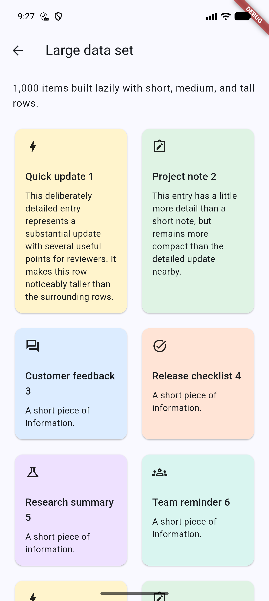

# aligned_grid_view

[](https://pub.dev/packages/aligned_grid_view)

Flutter grid widgets that make every tile in a row as tall as that row's
tallest tile. Use them when a standard `GridView` cannot express
content-driven, aligned rows.



## Features

* Lazy, scrollable aligned grids with fixed columns or responsive tile widths.
* `SliverAlignedGrid` for use alongside other slivers in a `CustomScrollView`.
* Fast paths for fixed or known variable row extents.
* Configurable main- and cross-axis spacing, keep-alives, and repaint
  boundaries.

## Installation

```sh
flutter pub add aligned_grid_view
```

```dart
import 'package:aligned_grid_view/aligned_grid_view.dart';
```

## Basic usage

```dart
AlignedGridView.count(
  crossAxisCount: 3,
  mainAxisSpacing: 8,
  crossAxisSpacing: 8,
  itemCount: items.length,
  itemBuilder: (context, index) => ItemCard(item: items[index]),
)
```

Use `AlignedGridView.extent` when tiles need a maximum cross-axis extent and
the number of columns should adapt to the available width:

```dart
AlignedGridView.extent(
  maxCrossAxisExtent: 220,
  mainAxisSpacing: 12,
  crossAxisSpacing: 12,
  itemCount: items.length,
  itemBuilder: (context, index) => ItemCard(item: items[index]),
)
```

For a grid within a `CustomScrollView`, use `SliverAlignedGrid`:

```dart
CustomScrollView(
  slivers: [
    const SliverAppBar(title: Text('Catalog')),
    SliverPadding(
      padding: const EdgeInsets.all(16),
      sliver: SliverAlignedGrid.count(
        crossAxisCount: 2,
        mainAxisSpacing: 12,
        crossAxisSpacing: 12,
        itemCount: items.length,
        itemBuilder: (context, index) => ItemCard(item: items[index]),
      ),
    ),
  ],
)
```

`AlignedGridView.custom` and the default `SliverAlignedGrid` constructor accept
a `SliverSimpleGridDelegate` when column calculation needs to be fully
customized.

## Known row extents

When every row has a known height, pass `mainAxisExtent`. This uses direct grid
geometry, avoids measuring tiles, and resolves distant scroll positions in
constant time:

```dart
AlignedGridView.count(
  crossAxisCount: 3,
  mainAxisExtent: 96,
  mainAxisSpacing: 8,
  itemCount: items.length,
  itemBuilder: (context, index) => ItemCard(item: items[index]),
)
```

`mainAxisExtent` must be at least as large as every tile in its row. For known
but varying row heights, use `mainAxisExtentBuilder`. Its argument is the row
index, not the item index:

```dart
AlignedGridView.count(
  crossAxisCount: 3,
  mainAxisExtentBuilder: (rowIndex) => rowExtents[rowIndex],
  mainAxisSpacing: 8,
  itemCount: items.length,
  itemBuilder: (context, index) => ItemCard(item: items[index]),
)
```

`mainAxisExtentBuilder` requires `itemCount`. Row extents and prefix offsets
are cached while the builder, item count, and spacing stay unchanged. Previously
visited offsets use binary search; a first jump to a distant uncached row still
evaluates the preceding row extents.

## Performance notes

The grid lazily builds visible rows. For finite lists, provide `itemCount` and
leave `shrinkWrap` disabled when possible. Use a known extent when supporting
very large data sets or distant programmatic scroll jumps.

For content-driven row heights, omit both extent options. Large `jumpTo`
operations remain expensive because the grid must build and measure the
intervening rows before their offsets are known.

For state-free tiles, consider `addAutomaticKeepAlives: false` to reduce memory.
Keep `addRepaintBoundaries` enabled for visually complex or frequently changing
tiles, and measure before adjusting `cacheExtent`. See
[benchmark.md](benchmark.md) for benchmark methodology and results.

## Example

The [example app](example) demonstrates fixed-column, responsive, sliver, and
large-data-set grids.

## License

This package is licensed under the [MIT License](LICENSE).
